# Accessing Scholar

## Prerequisites
This tutorial is designed to be possible with some limited familiarity with Unix environments. Chimera can be installed locally on students' personal computers or run remotely.

## About compute clusters at Purdue
Scholar is a compute cluster that designed for use in classes like ours. It is configured in much the same ways as other community compute clusters maintained by RCAC at Purdue. Currently (Spring 2024) there are several clusters used for research:
 - Negishi - Cluster built in 2022 that is focused on CPU-only calculations. Cluster access is possible by purchasing nodes.
 - Gilbreth - Cluster built in that is focused on GPU-enabled applications like machine learning. Cluster access is possible by purchasing nodes.
 - Anvil - Massive cluster built for NSF-funded projects. Cluster use is controlled through [ACCESS](https://access-ci.org/).
More info about compute clusters at Purdue is available at [RCAC's website](https://www.rcac.purdue.edu/compute).

## Accessing Scholar via ThinLinc
If you want a desktop environment, point a web browser to `desktop.scholar.rcac.purdue.edu`. You will be prompted for a username and password. Note that you will need to use your BoilerKey rather than Career Account password and use two-factor authentication. With this desktop environment, you can run Chimera, prepare proteins for docking, and visualize results.


## Accessing Scholar via SSH
If you just need to run programs via a command line interface, accessing Scholar via SSH makes sense. Again, your credentials for logging in are your netid and BoilerKey. More details about authentication is in on [RCAC's website](https://www.rcac.purdue.edu/news/2101).

### MacOS, Linux, or Windows 11
Open the Terminal and run:
```sh
ssh USERNAME@scholar.rcac.purdue.edu
```

### Windows 10 
A SSH client will be needed like [PuTTY](https://www.putty.org/)

## Setting up environment on Scholar

If you haven't already cloned this repository, do so now.

```sh
git clone https://github.com/bdrown/chm696-docking.git
```

The programs used in this tutorial and assignment are located on shared storage located at `/class/bsdrown/apps`. To make them more easily accessible, we can introduce a short script that runs whenever a terminal is openned. Connect to Scholar via ThinLinc and open the terminal. If this repository has been cloned, then copy the bash_profile to your home directory:

```sh
cp /class/bsdrown/etc/bashrc ~/.bash_profile
```

Then close and reopen your terminal. This should add `chimera` and a single-threaded version of `dock` to your path. Running `which chimera` should provide the result `/class/bsdrown/apps/chimera-1.17.3/bin/chimera`.

# Download a Protein Structure from the PDB
Download a protein complex from [RSCB PDB](https://rscb.org). For this tutorial, we will be using PDB 2ITO which contains a cocrystal structure of the mutant EGFR kinase (G719S) in complex with Iressa. Enter `2ITO` into the search bar on RSCB PDB to visit the entry page for this deposited structure. PDB entry pages provide a variety of useful information.

## Fetch structure directly with wget (option 1)
When files are publicly hosted, it is sometimes more efficient to have a remote cluster directly fetch them rather than downloading them to your local machine and then transferring.

```sh
# make folder for structures handled with Chimera and enter it
mkdir -p ~/chm696-docking/001_structure
cd ~/chm696-docking/001_structure
# fetch file from PDB
wget -O 2ITO.pdb.gz https://files.rcsb.org/download/2ITO.pdb1.gz
```

You should now have a file named `2ITO.pdb.gz` in the folder `001_structure`.

## Download file by navigating to page with Firefox (option 2)

Firefox is the internet browswer installed on Scholar. You can use it to visit RSCB PDB and download the structure coordinates. Towards the right hand side of the 2ITO entry page, click on Download Files, and select "Biological Assembly 1 (PDB - gz)"
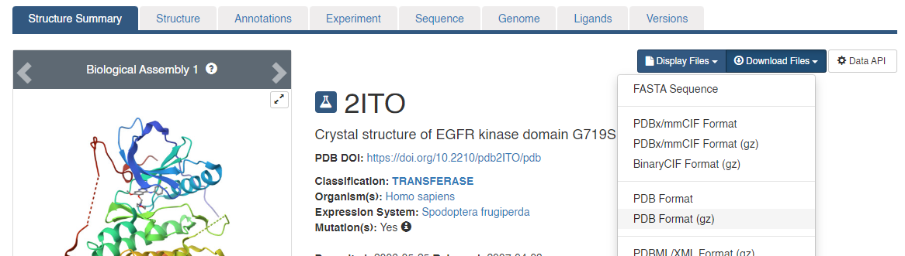

This will download the coordinates and save the file in `/homes/USERNAME/Downloads`. Move the file to `~/chm696-docking/001_structure` with the File Manager.

# Prepare structures for docking with Chimera

The following steps will demonstrate the preparation of the protein and ligand which will be used by DOCK6. While there are other ways to prepare structures, Chimera makes it convenient through a graphical user interface.

To launch Chimera, open a terminal and run the command `chimera`. If this fails and you have not copied the `bash_profile` as described above, the full path to Chimera is `/class/bsdrown/apps/chimera-1.17.3/bin/chimera`.

Open the `2ITO.pdb.gz` file that you downloaded from RSCB PDB and inspect the structure.

## Fix Missing Loops
You will notice that there are some disordered regions of the crystal structure that resulted in missing loops (indicated by dashed lines). There are many methods for modeling missing structures, but we will run [Modeller](https://salilab.org/modeller/) directly through Chimera. To fix the missing sections, go to Tools -> Surface Editing -> Model/Refine Loops. Two dialogue boxes will appear

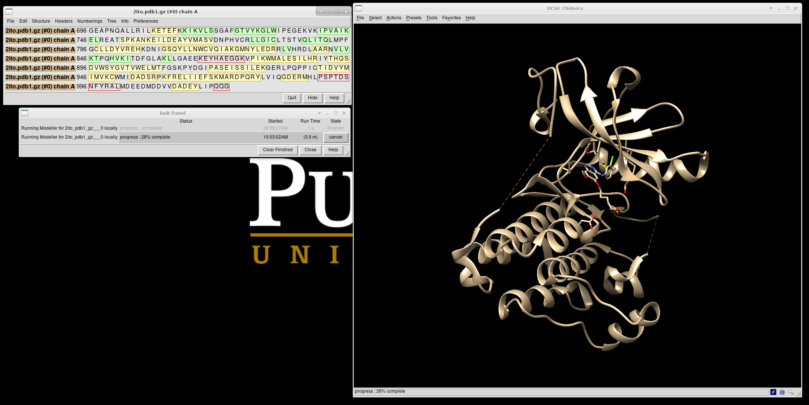

In the Model Loops / Refine Structure window select the following parameters. The location of the Modeller executable is `/class/bsdrown/apps/modeller/bin/mod10.5`. With the appropriate options selected, click OK to run Modeller on the head node. Depending on the size of the loops that need to be generated, Modeller can take 5-10 minutes.

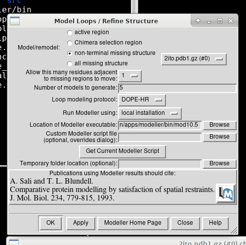

Modeller will generate 5 models from which we can choose.  Decide which one you want to keep, highlight it and save the file by choosing File → Save PDB. In the dialogue box, be sure to give this file a new name so as not to overwrite the original `2ITO.pdb` file, something similar to `2ITO_loops_fixed.pdb`. In the 'Save models' section, choose the model number chosen. To confirm that everything has worked correctly, close the current session in Chimera and open `2ITO_loops_fixed.pdb`. Now no dashed lines should be seen and only the structure with the fixed loops.

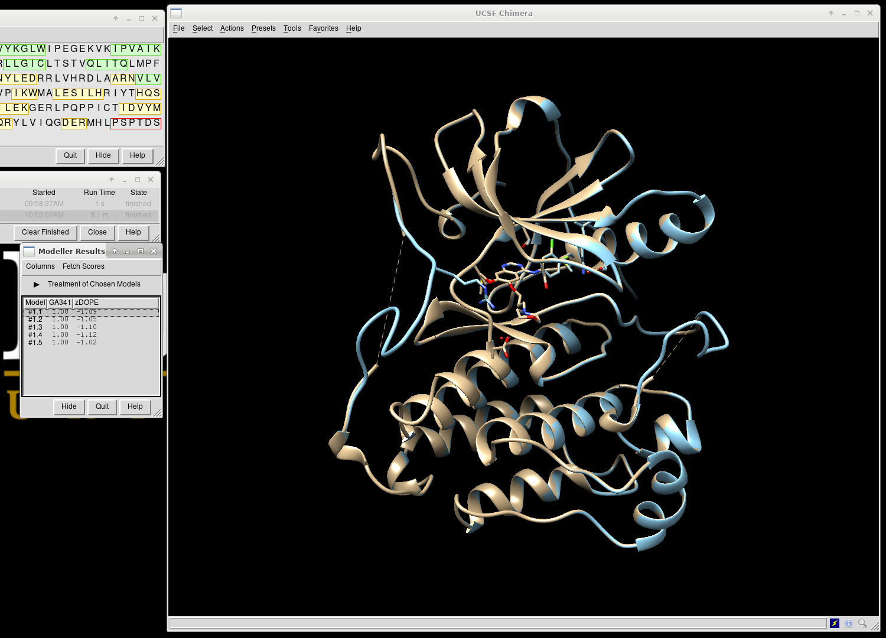

## Prepare Protein
Structures obtained by X-ray crystallography generally do not include coordinates for hydrogens as they have insufficient electron density to be observed. We will need to add hydrogens and calculate atomic partial charges for both the protein/receptor and ligand/small-molecule, but we'll process then independently. The first step in preparing the protein is to get the protein structure alone in a `.pdb` file. To do this:

1. Select an atom on the protein by folding Ctrl and left-clicking an atom.
2. Press the up arrow until the entire protein is selected
3. Go to Select → Invert (all models). This will change the selection from the protein to everything else in the structure
4. Go to Actions → Atoms/Bonds → Delete
5. Save the structure with a new file name (i.e. `2ITO_protein_only.pdb`). Your pdb file will now look similar to this:

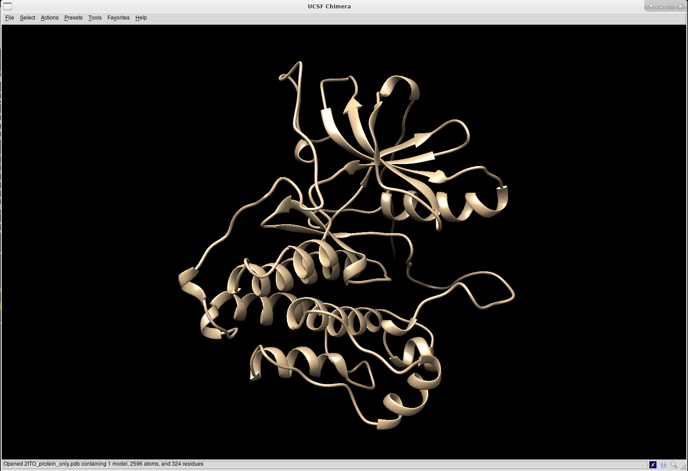

At this point we also need to generate a `.mol2` file for the structure in this state. Go to File → Save Mol2 and give the file a descriptive name such as `2ito_protein_no_hydrogens_no_charges.mol2`

There are now two more steps necessary for its preparation:

1. Adding hydrogens
2. Adding charge

To add hydrogen atoms click on: Tools → Structure Editing → AddH. This command will cause the following dialogue box to appear:

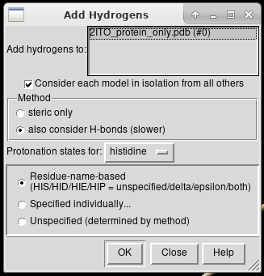

If the hydrogen atoms were successfully added, white ends to the atoms would appear which are the hydrogens. The final step is to add charges to the protein. To add charges click on Tools → Structure Editing → Add Charge and the following dialogue box will show up:


Click on 'OK' and once the program is finished the bottom left hand corner tells what the total charge of the structure is. This number should be an integer (e.g. -8). The protein structure is now completely prepared and ready for docking. The final step is to save two files, a .pdb of the structure in this state and a .mol2 file. Simply go to File → Save PDB and choose a filename such as `2ITO_protein_with_charges.pdb`; then go to File → Save Mol2 and choose a filename such as `2ITO_protein_with_charges.mol2`.

## Prepare Ligand

Close your Chimera session and reopen the `2ITO.pdb` file. As was done for the protein, we'll select the small-molecule ligand, add hydrogens, and determine partial charges. To do this:

1. Select an atom on the ligand by holding Ctrl and left-clicking
2. Press the up arrow until the entire ligand is selected (press the up arrow many times)
3. Go to Select → Invert (all models). This will change the selection from the ligand to everything else in the structure
4. Go to Actions → Atom/Bonds → Delete
   
Before we start preparing the ligand for docking we need to again save a `.mol2` file for the structure in this state. Go to File → Save Mol2 and give the file a descriptive name such as `2ITO_no_hydrogens_no_charges.mol2`.

Once the ligand is saved as its own file the same two steps are followed as for the protein:

1. Add hydrogens
2. Add charges

The final step is to add charges to the ligand. The same steps as for the protein are followed except after the dialogue box appear and click 'OK', a second box will appear in which the net charge of the ligand is specificied:

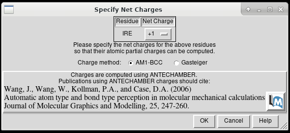

Select OK and partial charges for the ligand will be calculated. Calculations are complete when a total charge for the molecule is displayed in the bottom-left corner of the window.

The ligand is ready for docking. The final step is to again save two files, a `.pdb` and `.mol2` of the structure in this state. Go to File → Save Mol2 and give the file a name such as `2ITO_ligand_only.mol2` and File → Save PDB and give the file a name such as `2ITO_ligand_only.pdb`.


# Creating the Protein Binding Site Surface

This section walks through the steps necessary to identify the binding site of the protein using a function within DOCK to place surface spheres along the protein.

## Create DMS file
In Chimera, open the `2ITO_protein_only.pdb` file. Go to Actions -> Surface -> Show.

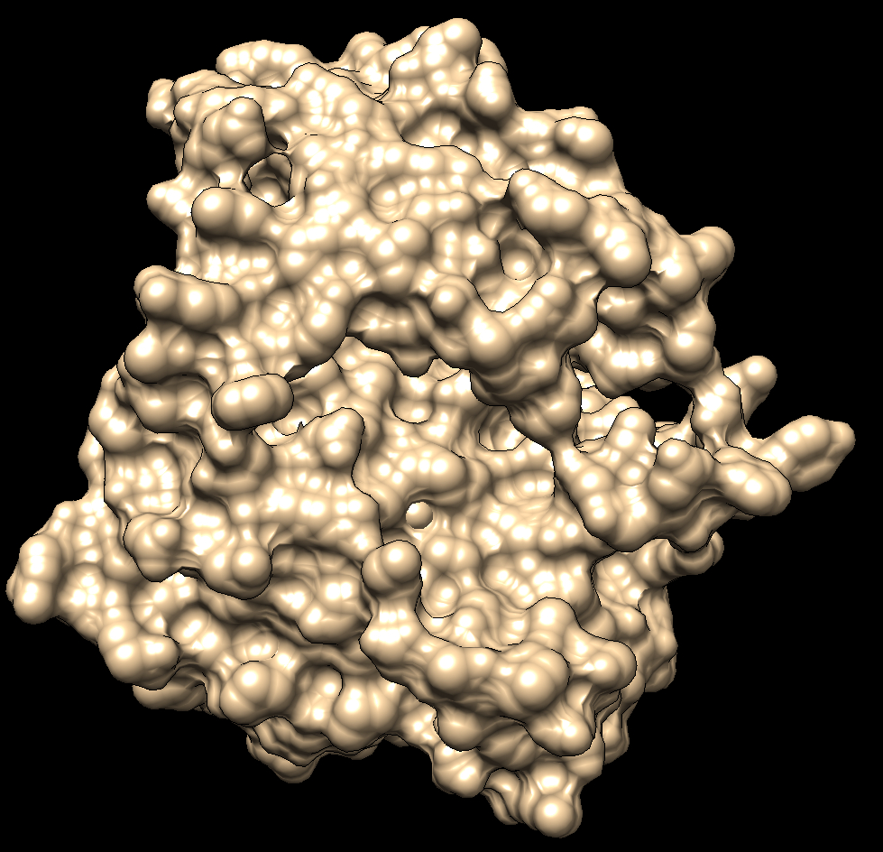

Generate the .dms file by selecting Tools -> Structure Editing -> Write DMS. A dialogue box will appear and you should provide a reasonable filename and save it to `002_surface_spheres`, such as `2ITO_surface.dms`. Once this file is daved, make sure the surface was created correctly. Close the current session in Chimera, open `2ITO_protein_only.pdb` and then open `2ITO_surface.dms`. The small dots (which is the .dms file) should be aligned over the protein structure. If everything looks good, we can continue to further steps.

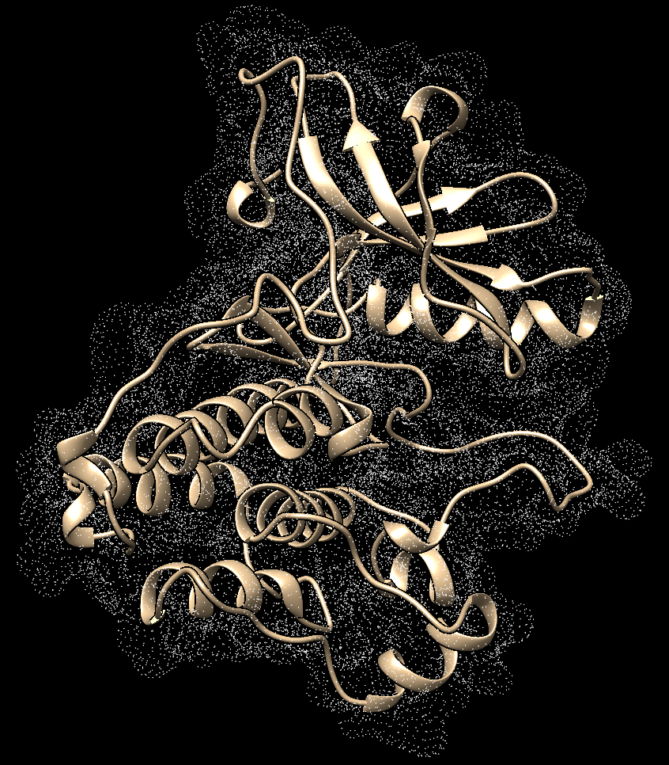

## Generate Spheres for the Binding Site
Now that a .dms file has been generated, the binding site of the protein is found using a DOCK program called `sphgen`. This program is run on the command line on Scholar. We need to provide `sphgen` with parameters to run; these parameters are provided in a file, `INSPH`. You can generate this file yourself or use the one provided in this repository. Let's take a look at `INSPH`:

```
 2ITO_surface.dms
 R
 X
 0.0
 4.0
 1.4
 2ITO.sph
```

Note that the first and last lines need to match the filenames of the protein involved in this tutorial. Save this file and return to the command line, change the working directory to `002_surface_spheres`, and run `sphgen` with the following commands:

```sh
cd 002_surface_spheres
sphgen -i INSPH -o OUTSPH
```

When this is completed you will see the new `2ITO.sph` file in the directory. Once again one needs to verify that this file was generated properly. Do this by comparing it to the original `.pdb`. Start a new Chimera session, open the original `.pdb` file and the two structures should be aligned to each other. The image should be similar to:

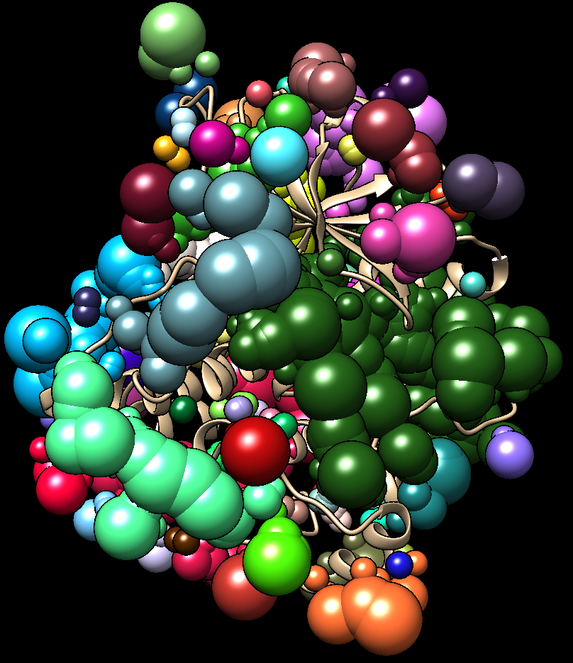

## Binding Site Spheres

While all of the possible binding sites have been identified with sphere generation, we need to select the spheres that define the binding site for the ligand in this complex. Keeping the working directory at `002_surface_spheres`, run `sphere_selector` to select the spheres that overlap with the bound ligand:

```sh
sphere_selector 2ITO.sph ../001_structure/2ITO_ligand_only.mol2 10.0
```

Next confirm that the correct spheres were selected:
  1. Close any open sessions in Chimera
  2. In Chimera open `selected_spheres.sph`
  3. In the current session, open the original protein/ligand complex (`2ITO.pdb`)
  4. Observe the spheres located within the binding site of the protein, similar to:
   
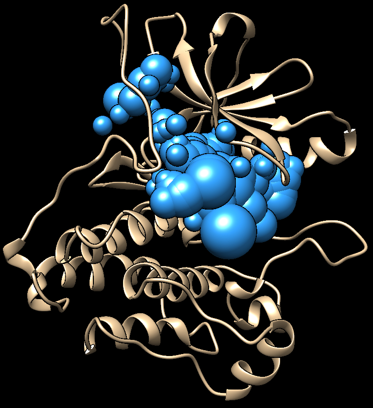

While this looks good one should verify that the spheres are actually where the ligand is. This is done by selecting the spheres, hiding them from view, and verifying the ligand is in the same location:

  1. Hold down ctrl and click on a sphere
  2. Press the up arrow until all spheres are selected Actions → Atoms/Bonds → hide
  3. Verify the ligand is where the spheres are
   
## Box and Grid Generation

The next step in the docking process is the box and grid generation. Instead of generating the energy interactions between all atoms of the protein and ligand, DOCK gets around this computationally expensive step by focusing solely on the area of interest around the protein-ligand binding pocket. Atoms that are far away from this site can be thought to have negligible impact on the energy interactions.

### Generating the Box
The first step is to create a box around the active site. Create a DOCK program called `showbox`. Do this in the `003_gridbox` directory.

We'll create a new file called `showbox.in` that contains the parameters for the program:

```
Y
8.0
../002_surface_spheres/selected_spheres.sph
1
2ITO.box.pdb
```

This will automoatically construct boxes to enclose the spheres, give 8.0 Angstroms from the spheres to draw the box, tells the file where to find the sphere file that we had previously generated, the cluster number, and the output filename.

Run `showbox` and provide the parameters with the following commands:

```sh
../003_gridbox
showbox < showbox.in
```

After running this script, 2ITO.box.pdb should show up in your directory.

### Generating the Grid

The next step is to generate the grid. This is accomplished by executing a DOCK program called `grid`.

As before, we'll create a file called `grid.in` containing necessary parameters:

```
compute_grids                yes
grid_spacing                 0.4
output_molecule              no
contact_score                no
energy_score                 yes
energy_cutoff_distance       9999
atom_model                   a
attractive_exponent          6
repulsive_exponent           9
distance_dielectric          yes
dielectric_factor            4
allow_non_integral_charges   yes
bump_filter                  yes
bump_overlap                 0.75
receptor_file                ../001_structure/2ITO_protein_with_charges.mol2
box_file                     2ITO.box.pdb
vdw_definition_file          /class/bsdrown/parameters/vdw_AMBER_parm99.defn
score_grid_prefix            grid
```

Once this file is created, run the following:
```sh
grid -i grid.in -o 2ITOGridInfo.out
```

Once complete, we will have three new files in our directory: `grid.bmp`, `grid.nrg`, and `2ITOGridInfo.out`.

# Docking Initial Ligand

There are 3 types of docking that we will be covering in this tutorial. The types and key differences are displayed below:

  - Rigid Docking - conformation search: rigid, orient: yes
  - Fixed Anchor Docking - conformation search: flex, orient: no
  - Flexible Docking - conformation search: flex, orient: yes
  - Rigid Docking - Rigid docking treats the ligand as a rigid structure and fits it the best it can into the binding site of the protein.
 
We will be working in the `004_dock` directory.

## Rigid Docking

To perform rigid docking, we'll need a parameter file named `rigid.in`.

```
conformer_search_type                                        rigid
use_internal_energy                                          yes
internal_energy_rep_exp                                      12
internal_energy_cutoff                                       100.0
ligand_atom_file                                             ../001_structure/2ITO_ligand_only.mol2
limit_max_ligands                                            no
skip_molecule                                                no
read_mol_solvation                                           no
calculate_rmsd                                               yes
use_rmsd_reference_mol                                       yes
rmsd_reference_filename                                      ../001_structure/2ITO_ligand_only.mol2
use_database_filter                                          no
orient_ligand                                                no
bump_filter                                                  no
score_molecules                                              yes
contact_score_primary                                        no
grid_score_primary                                           yes
grid_score_rep_rad_scale                                     1
grid_score_vdw_scale                                         1
grid_score_es_scale                                          1
grid_score_grid_prefix                                       ../003_gridbox/grid
minimize_ligand                                              yes
simplex_max_iterations                                       1000
simplex_tors_premin_iterations                               0
simplex_max_cycles                                           1
simplex_score_converge                                       0.1
simplex_cycle_converge                                       1.0
simplex_trans_step                                           1.0
simplex_rot_step                                             0.1
simplex_tors_step                                            10.0
simplex_random_seed                                          0
simplex_restraint_min                                        yes
simplex_coefficient_restraint                                10.0
atom_model                                                   all
vdw_defn_file                                                /class/bsdrown/data/parameters/vdw_AMBER_parm99.defn
flex_defn_file                                               /class/bsdrown/data/parameters/flex.defn
flex_drive_file                                              /class/bsdrown/data/parameters/flex_drive.tbl
ligand_outfile_prefix                                        2ITO.lig.min
write_orientations                                           no
num_scored_conformers                                        1
rank_ligands                                                 no
```

## Fixed Anchor Docking

In this session, we will be showing the tutorial for Fixed Anchor Docking. For this mode of docking, the algorithm will first identify the largest fragment extracted from original ligand input. Noted that, the fragments are segmented based on the rotatable bonds of the ligands. Starting from this fragment pose, the algorithm will use it as an anchor to continuously add segments until the whole original ligand pose has been fully re-grown. Note that when each fragment is added, it will be oriented for a pose that is energetically minimal. Comparing this method to the previous rigid docking mode, fixed anchor docking offer flexibility to the side chain while still being able to keep the general location of the ligand’s binding site as it fixes the anchor position.

A Dock input file `fixed.in` will be used to define how fixed anchor docking should be performed:

```
conformer_search_type                                        fixed
write_fragment_libraries                                     no
user_specified_anchor                                        no
limit_max_anchors                                            no
min_anchor_size                                              5
pruning_use_clustering                                       yes
pruning_max_orients                                          1000
pruning_clustering_cutoff                                    100
pruning_conformer_score_cutoff                               100.0
pruning_conformer_score_scaling_factor                       1.0
use_clash_overlap                                            no
write_growth_tree                                            no
use_internal_energy                                          yes
internal_energy_rep_exp                                      12
internal_energy_cutoff                                       100.0
ligand_atom_file                                             2ITO.lig.min_scored.mol2
limit_max_ligands                                            no
skip_molecule                                                no
read_mol_solvation                                           no
calculate_rmsd                                               yes
use_rmsd_reference_mol                                       yes
rmsd_reference_filename                                      2ITO.lig.min_scored.mol2
use_database_filter                                          no
orient_ligand                                                no
bump_filter                                                  no
score_molecules                                              yes
contact_score_primary                                        no
grid_score_primary                                           yes
grid_score_rep_rad_scale                                     1
grid_score_vdw_scale                                         1
grid_score_es_scale                                          1
grid_score_grid_prefix                                       ../003_gridbox/grid
minimize_ligand                                              yes
minimize_anchor                                              yes
minimize_flexible_growth                                     yes
use_advanced_simplex_parameters                              no
minimize_flexible_growth_ramp                                no
simplex_max_cycles                                           1
simplex_score_converge                                       0.1
simplex_cycle_converge                                       1
simplex_trans_step                                           1
simplex_rot_step                                             0.1
simplex_tors_step                                            10.0
simplex_anchor_max_iterations                                500
simplex_grow_max_iterations                                  500
simplex_grow_tors_premin_iterations                          0
simplex_random_seed                                          0
simplex_restraint_min                                        no
atom_model                                                   all
vdw_defn_file                                                /class/bsdrown/data/parameters/vdw_AMBER_parm99.defn
flex_defn_file                                               /class/bsdrown/data/parameters/flex.defn
flex_drive_file                                              /class/bsdrown/data/parameters/flex_drive.tbl
ligand_outfile_prefix                                        fixed.out
write_orientations                                           no
num_scored_conformers                                        1
rank_ligands                                                 no
```

With the Dock input file, you're ready to run:
```sh
dock6 -i fixed.in -o fixed.out
```

Dock6 should take 30 seconds to a minute to complete so if it completes immediately check the output file `fixed.out` for an error message. Successful runs should provide two new files:
 - `fixed.out` - a log of what happened and a report on the binding score
 - `fixed.out_scored.mol2` - mol2 file with the coordinates of the best binding pose

Using Chimera, compare the binding poses of the ligand predicted by rigid vs. fixed anchor docking:

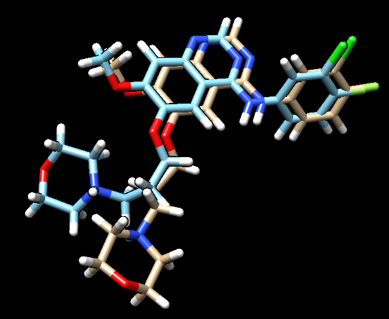

Hopefully you can see a difference in the pose of the morpholino chain.

## Flexible Docking
In this next portion, we will using flexible docking in which all conformations of the input ligand are tested. This is the most computational expensive method for docking ligands, thus we can expect that this method will take the longest time to screen a library of ligands.

The following are the input parameters for flexible ligand docking to be added to `flex.in`. It should be a good practice to make sure the files and directories for the dock parameters are up to date.

```
conformer_search_type                                        flex
write_fragment_libraries                                     no
user_specified_anchor                                        no
limit_max_anchors                                            no
min_anchor_size                                              5
pruning_use_clustering                                       yes
pruning_max_orients                                          1000
pruning_clustering_cutoff                                    100
pruning_conformer_score_cutoff                               100.0
pruning_conformer_score_scaling_factor                       1.0
use_clash_overlap                                            no
write_growth_tree                                            no
use_internal_energy                                          yes
internal_energy_rep_exp                                      12
internal_energy_cutoff                                       100.0
ligand_atom_file                                             2ITO.lig.min_scored.mol2
limit_max_ligands                                            no
skip_molecule                                                no
read_mol_solvation                                           no
calculate_rmsd                                               yes
use_rmsd_reference_mol                                       yes
rmsd_reference_filename                                      2ITO.lig.min_scored.mol2
use_database_filter                                          no
orient_ligand                                                yes
automated_matching                                           yes
receptor_site_file                                           ../002_surface_spheres/selected_spheres.sph
max_orientations                                             1000
critical_points                                              no
chemical_matching                                            no
use_ligand_spheres                                           no
bump_filter                                                  no
score_molecules                                              yes
contact_score_primary                                        no
grid_score_primary                                           yes
grid_score_rep_rad_scale                                     1
grid_score_vdw_scale                                         1
grid_score_es_scale                                          1
grid_score_grid_prefix                                       ../003_gridbox/grid
minimize_ligand                                              yes
minimize_anchor                                              yes
minimize_flexible_growth                                     yes
use_advanced_simplex_parameters                              no
minimize_flexible_growth_ramp                                no
simplex_max_cycles                                           1
simplex_score_converge                                       0.1
simplex_cycle_converge                                       1.0
simplex_trans_step                                           1.0
simplex_rot_step                                             0.1
simplex_tors_step                                            10.0
simplex_anchor_max_iterations                                500
simplex_grow_max_iterations                                  500
simplex_grow_tors_premin_iterations                          0
simplex_random_seed                                          0
simplex_restraint_min                                        no
atom_model                                                   all
vdw_defn_file                                                /class/bsdrown/data/parameters/vdw_AMBER_parm99.defn
flex_defn_file                                               /class/bsdrown/data/parameters/flex.defn
flex_drive_file                                              /class/bsdrown/data/parameters/flex_drive.tbl
ligand_outfile_prefix                                        flex.out
write_orientations                                           no
num_scored_conformers                                        1
rank_ligands                                                 no
```

With the input file, we're ready to run Dock:
```sh
dock6 -i flex.in -o flex.out 
```
The docking process will take 2-3 minutes to complete. If the program finished right away, it would be recommended that you should check the output file to see if there are any reported errors. Successful run should give you two additional files as followed:
 - `flex.out`
 - `flex.out_scored.mol2`

The `.mol2` file containing the docked ligand could be viewed in ChimeraX using ViewDock. To compare with the reference pose, this `.mol2` file (blue) has been overlaid on top of the original ligand pose (gold). With ViewDock in Chimera, it can be observed that the docked ligand showed great structural overlap with the reference pose and this has also been reflected in the reported RMSD score, which has been maintained below 2A.

# Virtual Screening of a Compound Library
After we have tested our control case for multiple docking modes, in this section we would carry out virtual screening for a larger database of ligands. In this step, the program will attempt to dock all of the input ligands into the binding site and this should be expected to be a time-consuming and computationally exhaustive step. For the purpose of this section, we will screen a 6,000-molecule database of kinase inhibitors available from MedChemExpress (MCE), but a safety step you can take is to try running the virtual screening with a smaller subset - containing 100 molecules, to make sure that the program works correctly. The directory to the database of both the 6,000 molecules and 100 molecules database is available in `/class/bsdrown/data/libraries`. There are several other compound libraries that might be more appropriate for other protein targets.

To conduct the virtual screen, we need an input file, `virtual.in`:

```
conformer_search_type                                        flex
write_fragment_libraries                                     no
user_specified_anchor                                        no
limit_max_anchors                                            no
min_anchor_size                                              5
pruning_use_clustering                                       yes
pruning_max_orients                                          1000
pruning_clustering_cutoff                                    100
pruning_conformer_score_cutoff                               100.0
pruning_conformer_score_scaling_factor                       1.0
use_clash_overlap                                            no
write_growth_tree                                            no
use_internal_energy                                          yes
internal_energy_rep_exp                                      9
internal_energy_cutoff                                       100.0
ligand_atom_file                                             /class/bsdrown/data/libraries/MCE_Kinase_100.mol2
limit_max_ligands                                            no
skip_molecule                                                no
read_mol_solvation                                           no
calculate_rmsd                                               no
use_database_filter                                          no
orient_ligand                                                yes
automated_matching                                           yes
receptor_site_file                                           ../002_surface_spheres/selected_spheres.sph
max_orientations                                             1000
critical_points                                              no
chemical_matching                                            no
use_ligand_spheres                                           no
bump_filter                                                  no
score_molecules                                              yes
contact_score_primary                                        no
contact_score_secondary                                      no
grid_score_primary                                           yes
grid_score_secondary                                         no
grid_score_rep_rad_scale                                     1
grid_score_vdw_scale                                         1
grid_score_es_scale                                          1
grid_score_grid_prefix                                       ../003_gridbox/grid
multigrid_score_secondary                                    no
dock3.5_score_secondary                                      no
continuous_score_secondary                                   no
footprint_similarity_score_secondary                         no
pharmacophore_score_secondary                                no
descriptor_score_secondary                                   no
gbsa_zou_score_secondary                                     no
gbsa_hawkins_score_secondary                                 no
SASA_score_secondary                                         no
amber_score_secondary                                        no
minimize_ligand                                              yes
minimize_anchor                                              yes
minimize_flexible_growth                                     yes
use_advanced_simplex_parameters                              no
simplex_max_cycles                                           1
simplex_score_converge                                       0.1
simplex_cycle_converge                                       1.0
simplex_trans_step                                           1.0
simplex_rot_step                                             0.1
simplex_tors_step                                            10.0
simplex_anchor_max_iterations                                500
simplex_grow_max_iterations                                  500
simplex_grow_tors_premin_iterations                          0
simplex_random_seed                                          0
simplex_restraint_min                                        no
atom_model                                                   all
vdw_defn_file                                                /class/bsdrown/data/parameters/vdw_AMBER_parm99.defn
flex_defn_file                                               /class/bsdrown/data/parameters/flex.defn
flex_drive_file                                              /class/bsdrown/data/parameters/flex_drive.tbl
ligand_outfile_prefix                                        virtual.out
write_orientations                                           no
num_scored_conformers                                        1
rank_ligands                                                 no
```

As you see from `virtual.in`, we will be using flexible ligand docking which will be very time consuming. Rather than docking the compounds one at a time on a single thread, we will create a parallelized job using [Message Passing Interface (MPI)](https://en.wikipedia.org/wiki/Message_Passing_Interface) and [Slurm](https://en.wikipedia.org/wiki/Slurm_Workload_Manager), the job management software running on Scholar. Details about running MPI jobs with Slurm on Scholar and other RCAC resources can be found on the [RCAC knowledgebase](https://www.rcac.purdue.edu/knowledge/scholar/run).

To submit a job to Slurm, we need to create a short script called `job`:
```sh
#!/bin/bash  
#
#SBATCH -A scholar
#SBATCH --nodes=1
#SBATCH --ntasks-per-node=32
#SBATCH --time=01:00:00
#SBATCH --job-name 2ito_small_vs
#SBATCH --error=%x-%J-%u.err
#SBATCH --output=%x-%J-%u.out

module load gcc/12.3.0
module load openmpi

mpirun -n 32 $DOCK_BASE_MPI/bin/dock6.mpi -i virtual.in -o virtual.out
```

The first few lines starting with `#SBATCH` define variables that Slurm needs to run the job:
 - `-A scholar` - Defines which [queue](https://www.rcac.purdue.edu/knowledge/scholar/run/slurm/queues) to run the job on. Run `slist` to see a list of available queues. Each queue has different resources available to jobs run on it and different time limits.
 - `--nodes=1` - Defines the number of nodes to run the job on. Think of each node as an independent computer. While Dock is capable of running across multiple nodes, we just need one for this tutorial.
 - `--ntasks-per-node=32` - Defines the number of threads or CPU cores to use for the job.
 - `--time=01:00:00` - Time requested for the job. Be mindful of the time you request; you can't ask for more time than the queue allows but Slurm will kill the job if you run out of time before you're done!
 - `--job-name` - As it sounds, this is just the name we give to the job to help us keep track of it.
 - `--error=%x-%J-%u.err` - This defines where to write error messages. There are a couple of special characters (`%x`, `%J`, and `%u`). These correspond to the job name, job ID, and user who submitted the job. These might add up to something like, `2ito_small_vs-302789-bsdrown.err`.
 - `--output=%x-%J-%u.out` - This defines where to write non-error messages. In most cases, Dock write messages to a different file.

There are two lines starting with `module load`. The [module command](https://www.rcac.purdue.edu/knowledge/module) makes software and software libraries available for use on the cluster. We need some of the libraries part of the `gcc` and `openmpi` modules.

Dock6 is executed with a command starting with `mpirun`. The `-n` option determines how many threads to use. This should match the value defined by `--ntasks-per-node`. We also need to call a different version of Dock that was compiled with OpenMPI located at `$DOCK_BASE_MPI/bin/dock6.mpi`. Finally, we have the typical definition of an input file and output file using the `-i` and `-o` options, respectively.

To submit this job script for Slurm for processing, run:
```sh
sbatch job
```

To check on the status of the job, run `squeue` with the `-u` option to filter for your username:
```sh
bsdrown@scholar-fe06:~/chm696-docking/005_virtual_screen $ squeue -u bsdrown
JOBID        USER      ACCOUNT      NAME             NODES   CPUS  TIME_LIMIT ST TIME
302789       bsdrown   scholar      2ito_small_vs        1     32     1:00:00  R 0:18
```

The virtual screen of 100 molecules should take ~20 minutes when run on 32 CPUs. The job will be complete when it no longer appears when calling `squeue`. The `virtual.out` file will also provide a summary statement at the very end that can be viewed by running `tail virtual.out`:

```sh
bsdrown@scholar-fe02:~/chm696-docking/005_virtual_screen $ tail virtual.out

                          Grid_Score:          -80.496506
                     Grid_vdw_energy:          -80.166756
                      Grid_es_energy:           -0.329749
           Internal_energy_repulsive:           73.981453


100 Molecules Processed
Total elapsed time:     1112.748 seconds
Finalizing MPI Routines...
```

## Large library screening (optional)
If the small virtual screen completed successfully, we can move to screening the full library. Based on the performance of the small screen, we would expect screening the full library to take ~20 hours. An alternative strategy is to break up the library into smaller chunks that can run in separate, shorter jobs. The MCE kinase library has been split into six `.mol2` files stored at `/class/bsdrown/data/libraries/MCE_Kinase`.

```sh
bsdrown@scholar-fe02:~/chm696-docking/006_virtual_screen_large $ squeue -u bsdrown
JOBID        USER      ACCOUNT      NAME             NODES   CPUS  TIME_LIMIT ST TIME
303128       bsdrown   scholar      2ito_large_vs_6      1     32     4:00:00 PD 0:00
303127       bsdrown   scholar      2ito_large_vs_5      1     32     4:00:00 PD 0:00
303126       bsdrown   scholar      2ito_large_vs_4      1     32     4:00:00 PD 0:00
303125       bsdrown   scholar      2ito_large_vs_3      1     32     4:00:00 PD 0:00
303124       bsdrown   scholar      2ito_large_vs_2      1     32     4:00:00  R 0:10
303123       bsdrown   scholar      2ito_large_vs_1      1     32     4:00:00  R 1:06
```

What results will be six `.mol2` files that will need to be combined. 

```sh
cat *.mol2 > virtual.out_scored.mol2
```

# Cartesian Minimization of Virtually Screened Small Molecules
In this step, we use the results from the virtual screen and minimize the energy of the docked structures. Thus, this step will not be as time-consuming as the previous step because the ligands have already been placed in the binding site of the protein used in virtual screening.

Depending on whether you screened the entire MCE library or only the 100-molecule subset. In the following input file (`min.in`), we will minimize the smaller screen but you can adjust file paths accordingly to minimize the larger dataset.

```
conformer_search_type                                        rigid
use_internal_energy                                          yes
internal_energy_rep_exp                                      12
internal_energy_cutoff                                       100
ligand_atom_file                                             ../005_virtual_screen/virtual.out_scored.mol2
limit_max_ligands                                            no
skip_molecule                                                no
read_mol_solvation                                           no
calculate_rmsd                                               no
use_database_filter                                          no
orient_ligand                                                no
bump_filter                                                  no
score_molecules                                              yes
contact_score_primary                                        no
grid_score_primary                                           no
multigrid_score_primary                                      no
dock3.5_score_primary                                        no
continuous_score_primary                                     yes
cont_score_rec_filename                                      ../001_structure/2ITO_protein_with_charges.mol2
cont_score_att_exp                                           6
cont_score_rep_exp                                           12
cont_score_rep_rad_scale                                     1
cont_score_use_dist_dep_dielectric                           yes
cont_score_dielectric                                        4.0
cont_score_vdw_scale                                         1.0
cont_score_es_scale                                          1.0
minimize_ligand                                              yes
simplex_max_iterations                                       1000
simplex_tors_premin_iterations                               0
simplex_max_cycles                                           1.0
simplex_score_converge                                       0.1
simplex_cycle_converge                                       1.0
simplex_trans_step                                           1.0
simplex_rot_step                                             0.1
simplex_tors_step                                            10.0
simplex_random_seed                                          0
simplex_restraint_min                                        no
atom_model                                                   all
vdw_defn_file                                                /class/bsdrown/data/parameters/vdw_AMBER_parm99.defn
flex_defn_file                                               /class/bsdrown/data/parameters/flex.defn
flex_drive_file                                              /class/bsdrown/data/parameters/flex_drive.tbl
ligand_outfile_prefix                                        2ito.virtual_screen.min
write_orientations                                           no
num_scored_conformers                                        1
rank_ligands                                                 no
```

We'll still run this job on the compute nodes by submitting a job script via Slurm:

```sh
#!/bin/bash  
#
#SBATCH -A scholar
#SBATCH --nodes=1
#SBATCH --ntasks-per-node=8
#SBATCH --time=00:20:00
#SBATCH --job-name 2ito_vs_min
#SBATCH --error=%x-%J-%u.err
#SBATCH --output=%x-%J-%u.out

module load gcc/12.3.0
module load openmpi

mpirun -n 8 $DOCK_BASE_MPI/bin/dock6.mpi -i min.in -o min.out
```

Save the `job` script and submit it via Slurm:
```sh
sbatch job
```

# Rescoring and Ranking Virtual-Screened Molecules
For this step, not only will we try to re-dock the molecule, but we would also re-rank the molecules based on Footprint Scoring and thus, by comparing these molecules with one another, we would be able to rank which one has the highest potential to be a potential lead.

```
 conformer_search_type                                        rigid
 use_internal_energy                                          yes
 internal_energy_rep_exp                                      12
 internal_energy_cutoff                                       100
 ligand_atom_file                                             ../005_virtual_screen/virtual.out_scored.mol2
 limit_max_ligands                                            no
 skip_molecule                                                no
 read_mol_solvation                                           no
 calculate_rmsd                                               no
 use_database_filter                                          no
 orient_ligand                                                no
 bump_filter                                                  no
 score_molecules                                              yes
 contact_score_primary                                        no
 contact_score_secondary                                      no
 grid_score_primary                                           no
 grid_score_secondary                                         no
 multigrid_score_primary                                      no
 multigrid_score_secondary                                    no
 dock3.5_score_primary                                        no
 dock3.5_score_secondary                                      no
 continuous_score_primary                                     no
 continuous_score_secondary                                   no
 footprint_similarity_score_primary                           no
 footprint_similarity_score_secondary                         no
 pharmacophore_score_primary                                  no
 pharmacophore_score_secondary                                no
 descriptor_score_primary                                     yes
 descriptor_score_secondary                                   no
 descriptor_use_grid_score                                    no
 descriptor_use_multigrid_score                               no
 descriptor_use_continuous_score                              no
 descriptor_use_footprint_similarity                          yes
 descriptor_use_pharmacophore_score                           yes
 descriptor_use_hungarian                                     yes
 descriptor_use_volume_overlap                                yes
 descriptor_fps_score_use_footprint_reference_mol2            yes
 descriptor_fps_score_footprint_reference_mol2_filename       ../004_dock/2ITO.lig.min_scored.mol2
 descriptor_fps_score_foot_compare_type                       Euclidean
 descriptor_fps_score_normalize_foot                          no
 descriptor_fps_score_foot_comp_all_residue                   yes
 descriptor_fps_score_receptor_filename                       ../001_structure/2ITO_protein_with_charges.mol2
 descriptor_fps_score_vdw_att_exp                             6
 descriptor_fps_score_vdw_rep_exp                             12
 descriptor_fps_score_vdw_rep_rad_scale                       1
 descriptor_fps_score_use_distance_dependent_dielectric       yes
 descriptor_fps_score_dielectric                              4.0
 descriptor_fps_score_vdw_fp_scale                            1
 descriptor_fps_score_es_fp_scale                             1
 descriptor_fps_score_hb_fp_scale                             0
 descriptor_fms_score_use_ref_mol2                            yes
 descriptor_fms_score_ref_mol2_filename                       ../004_dock/2ITO.lig.min_scored.mol2
 descriptor_fms_score_write_reference_pharmacophore_mol2      no
 descriptor_fms_score_write_reference_pharmacophore_txt       no
 descriptor_fms_score_write_candidate_pharmacophore           no
 descriptor_fms_score_write_matched_pharmacophore             no
 descriptor_fms_score_compare_type                            overlap
 descriptor_fms_score_full_match                              yes
 descriptor_fms_score_match_rate_weight                       5.0
 descriptor_fms_score_match_dist_cutoff                       1.0
 descriptor_fms_score_match_proj_cutoff                       .7071
 descriptor_fms_score_max_score                               20
 descriptor_fingerprint_ref_filename                          ../004_dock/2ITO.lig.min_scored.mol2
 descriptor_hms_score_ref_filename                            ../004_dock/2ITO.lig.min_scored.mol2
 descriptor_hms_score_matching_coeff                          -5
 descriptor_hms_score_rmsd_coeff                              1
 descriptor_volume_score_reference_mol2_filename              ../004_dock/2ITO.lig.min_scored.mol2
 descriptor_volume_score_overlap_compute_method               analytical
 descriptor_weight_fps_score                                  1
 descriptor_weight_pharmacophore_score                        1
 descriptor_weight_fingerprint_tanimoto                       -1
 descriptor_weight_hms_score                                  1
 descriptor_weight_volume_overlap_score                       -1
 gbsa_zou_score_secondary                                     no
 gbsa_hawkins_score_secondary                                 no
 SASA_score_secondary                                         no
 amber_score_secondary                                        no
 minimize_ligand                                              no
 atom_model                                                   all
 vdw_defn_file                                                /class/bsdrown/data/parameters/vdw_AMBER_parm99.defn
 flex_defn_file                                               /class/bsdrown/data/parameters/flex.defn
 flex_drive_file                                              /class/bsdrown/data/parameters/flex_drive.tbl
 chem_defn_file                                               /class/bsdrown/data/parameters/chem.defn
 pharmacophore_defn_file                                      /class/bsdrown/data/parameters/ph4.defn
 ligand_outfile_prefix                                        2ito.output
 write_footprints                                             yes
 write_hbonds                                                 yes
 write_orientations                                           no
 num_scored_conformers                                        1
 rank_ligands                                                 no
```

Despite being a fast computation, we'll still submit this as a job to Slurm:

```sh
#!/bin/bash  
#
#SBATCH -A scholar
#SBATCH --nodes=1
#SBATCH --ntasks-per-node=16
#SBATCH --time=01:00:00
#SBATCH --job-name 2tio_vs_rescore
#SBATCH --error=%x-%J-%u.err
#SBATCH --output=%x-%J-%u.out
 
module load gcc/12.3.0
module load openmpi
 
mpirun -n 16 $DOCK_BASE_MPI/bin/dock6.mpi -i rescore.in -o rescore.out
```

Run the job:

```sh
sbatch job
```
